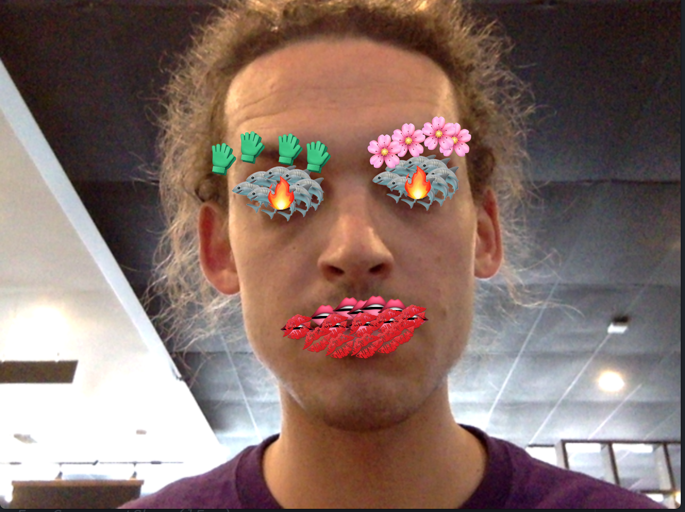

# emojiCV
Making some stuff using emojis and computer vision using P5.js

What's inside:  

build1/ the base. Facetracking + drawing outlines of face components in real time on the face  
build2/ replaces drawing outlines of the face components with just drawing emojis for each  
build3/ some different emojis and combining the two methods
build4/ added in real time emotion estimation  
build5/ drawing the face with emojis that change based on tracked emotions  
build6/ emotion reactive facetracking emoji halo effect  
build7/ changed up the halo a bit and added in a feature that will shoot emojis out of your mouth  

Some screencaps in the /MOV, /PNG, and /MP4 files
